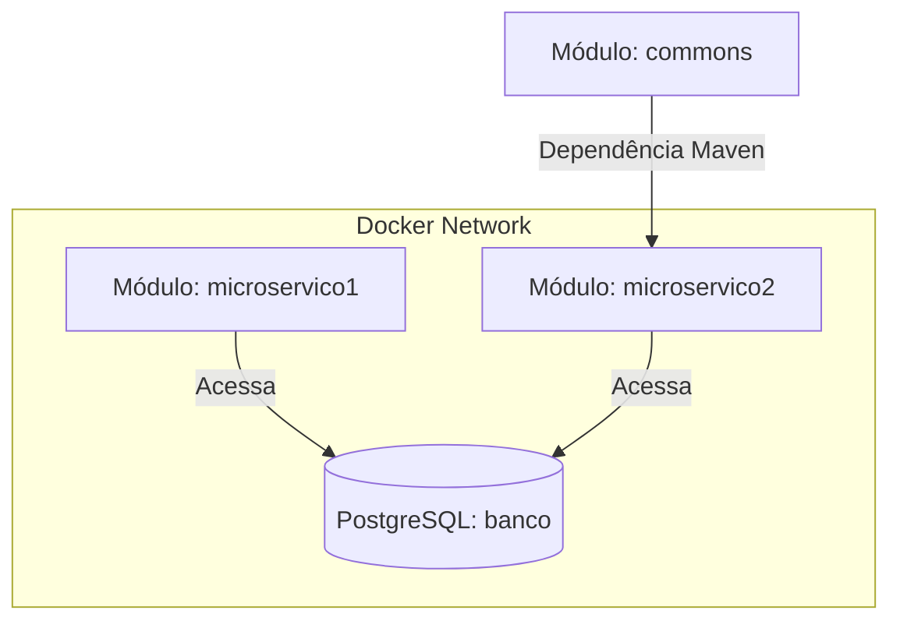
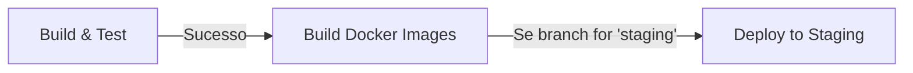

# Spring Microservices Demo 🚀

Este projeto é uma demonstração de arquitetura de microsserviços desenvolvida com **Spring Boot**, contendo múltiplos módulos, segurança HTTPS/SSL, banco de dados relacional (PostgreSQL), conteinerização com Docker e integração com ferramentas de qualidade (JaCoCo e SonarQube).

---

## 🏗️ Arquitetura do Projeto

O repositório é um projeto multi-módulo contendo três componentes principais:



1. **[commons](file:///mnt/c/Users/mcmor/Dropbox/M/WSGitLocalNew/%23SpringDemos/springmicroservicesdemo/commons)**: Biblioteca compartilhada que contém classes e modelos comuns utilizados por outros microsserviços.
2. **[microservico1](file:///mnt/c/Users/mcmor/Dropbox/M/WSGitLocalNew/%23SpringDemos/springmicroservicesdemo/microservico1)**: Microsserviço responsável pela entidade `User` e pela persistência de dados em banco de dados PostgreSQL.
3. **[microservico2](file:///mnt/c/Users/mcmor/Dropbox/M/WSGitLocalNew/%23SpringDemos/springmicroservicesdemo/microservico2)**: Microsserviço de citações (Citations) que consome o módulo `commons` e possui integrações com SonarQube e Jacoco.

---

## 🛠️ Tecnologias e Ferramentas

- **Java 21 / Java 17** (commons)
- **Spring Boot 3.1.0** (Spring Web, Spring Data JPA, Actuator, DevTools)
- **Lombok** (para redução de código boilerplate)
- **PostgreSQL** (banco de dados relacional)
- **Docker & Docker Compose** (para orquestração de containers)
- **JaCoCo** (Plugin de cobertura de código para testes unitários)
- **SonarQube** (Análise de qualidade de código e segurança)
- **Thunder Client** / **Postman** (Testes de APIs REST)

---

## 🔒 Segurança (HTTPS / SSL)

Ambos os microsserviços estão configurados para operar sob protocolo seguro **HTTPS** através de um certificado SSL embutido em um arquivo keystore (`keystore.p12` no formato PKCS12).

- **Senha do KeyStore:** `springboot`
- **Alias do Certificado:** `tomcat`

---

## 🚀 Como Executar o Projeto

### Pré-requisitos
Certifique-se de ter instalado em sua máquina:
- JDK 21
- Maven 3.8+
- Docker & Docker Compose

### Passo 1: Instalar o módulo `commons` localmente
Como o `microservico2` possui dependência direta do módulo `commons`, você precisa empacotar e instalar o `commons` no seu repositório local do Maven (`.m2`):

```bash
cd commons
mvn clean install
cd ..
```

### Passo 2: Empacotar os Microsserviços
Gere os arquivos `.jar` de ambos os serviços:

```bash
# Empacotar microservico1
cd microservico1
mvn clean package -DskipTests
cd ..

# Empacotar microservico2
cd microservico2
mvn clean package -DskipTests
cd ..
```

### Passo 3: Subir a Infraestrutura com Docker Compose
O arquivo [docker-compose.yaml](file:///mnt/c/Users/mcmor/Dropbox/M/WSGitLocalNew/%23SpringDemos/springmicroservicesdemo/docker-compose.yaml) irá subir o banco de dados PostgreSQL e os dois microsserviços.

Execute na raiz do projeto:
```bash
docker compose up --build
```

#### Mapeamento de Portas no Docker Compose:
- **Banco de Dados (PostgreSQL):** Porta `5432` no host local.
- **microservico1 (doiscontainers-1):** Porta interna `443` (HTTPS) mapeada para a porta **`443`** externa.
- **microservico2 (doiscontainers-2):** Porta interna `443` (HTTPS) mapeada para a porta **`444`** externa.

---

## 🛰️ Testando os Endpoints

Você pode utilizar a coleção de requisições do Thunder Client inclusa em [thunder-collection_SpringMicroserviceDemo.json](file:///mnt/c/Users/mcmor/Dropbox/M/WSGitLocalNew/%23SpringDemos/springmicroservicesdemo/thunder-collection_SpringMicroserviceDemo.json).

### 1. Microsserviço 1 (Serviço de Usuário)
* **URL:** `https://localhost:443/user?fn=michael&ln=mora`
* **Método:** `GET`
* **Resposta Esperada:**
  ```json
  {
    "id": 1,
    "firstName": "michaelmichael",
    "lastName": "moramora"
  }
  ```

### 2. Microsserviço 2 (Serviço de Citação)
* **URL:** `https://localhost:444/citation`
* **Método:** `GET`
* **Resposta Esperada:** Retorna uma citação inspiradora aleatória em formato texto.

*Nota: Ao acessar por HTTPS no navegador ou ferramentas locais, será necessário aceitar o certificado autoassinado.*

---

## 🧪 Testes e Análise de Qualidade (JaCoCo & SonarQube)

O `microservico2` possui configurações específicas de qualidade:

### Executando Testes de Cobertura (JaCoCo)
Rode o comando a seguir no diretório do `microservico2`:
```bash
cd microservico2
mvn clean test
```
Os relatórios de cobertura do JaCoCo estarão disponíveis em: `target/site/jacoco/index.html`.

### Executando Análise SonarQube
Inicie um servidor local do SonarQube na porta 9000 e rode a análise:
```bash
mvn sonar:sonar
```
As propriedades e tokens de acesso estão pré-configurados nos arquivos [sonar-project.properties](file:///mnt/c/Users/mcmor/Dropbox/M/WSGitLocalNew/%23SpringDemos/springmicroservicesdemo/microservico2/sonar-project.properties) e [pom.xml](file:///mnt/c/Users/mcmor/Dropbox/M/WSGitLocalNew/%23SpringDemos/springmicroservicesdemo/microservico2/pom.xml).

---

## 🔄 Pipeline CI/CD (GitHub Actions)

A pipeline automatizada do projeto está configurada em [.github/workflows/ci-cd.yml](file:///mnt/c/Users/mcmor/Dropbox/M/WSGitLocalNew/#SpringDemos/springmicroservicesdemo/.github/workflows/ci-cd.yml) e é acionada em commits nas branches de desenvolvimento, staging e master/main, além de pull requests.

A pipeline é composta por 3 estágios (Jobs):



### 1. Build & Test (Ambiente de Testes)
- Executa a compilação completa com o JDK 21.
- Roda os testes unitários de todos os microsserviços.
- Armazena relatórios JUnit e cobertura do JaCoCo como artefatos da build.

### 2. Build Docker Images
- Compila os JARs de produção de cada microsserviço.
- Cria imagens Docker multi-plataforma e as publica no **GitHub Container Registry (GHCR)** com a tag `latest` e o hash do commit (`sha`).
- Acionado apenas em branches produtivas e de staging (`master`, `main` e `staging`).

### 3. Deploy to Staging (Ambiente de Staging)
- Acionado automaticamente ao fazer push para a branch `staging`.
- Realiza o deploy e inicialização dos microsserviços localmente no GitHub Actions Runner utilizando Docker Compose.
- Executa testes de fumaça (smoke test) utilizando `curl` nos endpoints locais.


